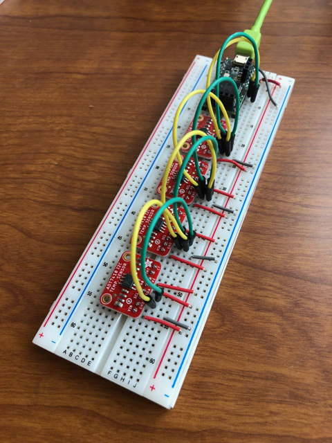
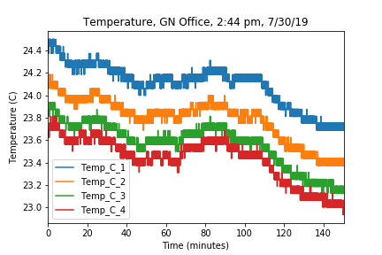

# Purpose

Simple Arduino script to run on a Teensy 3.2 microcontroller to read 1 to 4 [Adafruit ADT7410 temperature sensors](https://www.adafruit.com/product/4089) over I2C and stream over serial. 

Jupyter notebook with python code to read temperature data over serial, save to a csv file, and do some simple processing and plotting with pandas.

# Circuit

# Temperature vs time

Measurement in my office on July 30, 2019. Temperature resolution of ADT7410 is default 13 bits.

