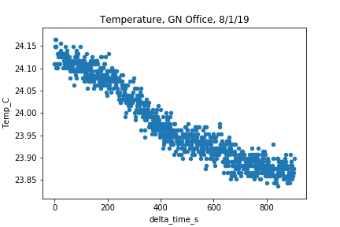
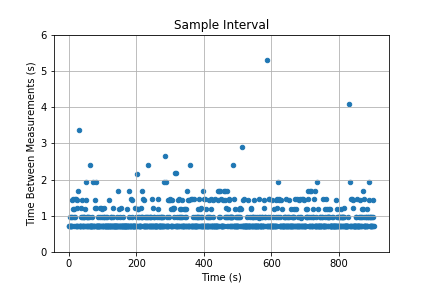

# Purpose

Simple python script to run on an [Adafruit ItsyBitsy M4 Express featuring ATSAMD51](https://www.adafruit.com/product/3800) microcontroller to read an [Adafruit ADT7410 temperature sensor](https://www.adafruit.com/product/4089) over I2C and stream over serial to a Jupyter notebook. 

# Circuit

Don't forget to put 2.2 k&Omega; pullup resistors on the microcontroller's SDA and SCL lines.

# Measurements

## Temperature vs time

Measurement in my office on August 1, 2019. Temperature resolution of ADT7410 is set to 16 bits (0.0078&deg;C).

## Time interval between temperature measurements

In the circuitpython code time.sleep(1.0) is used to make temperature measurements about every second. However, as seen below, there is wide variability in the actual time interval. Unfortunately, circuitpython has no facility to use timer interrupts so it looks like this is about the best it can do.

